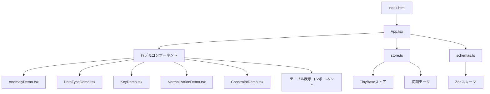
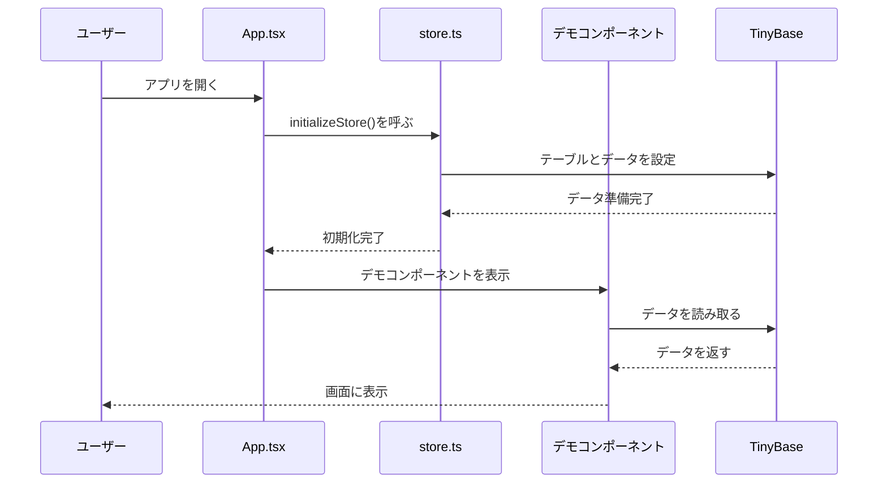

# 実装済みコードの見方ガイド 📚

このガイドでは、データベース設計の原理原則を学ぶためのデモアプリケーションのコードを、どう読んで理解すればいいかを説明するよ！✨

## 📁 プロジェクトの全体構造

まずは、プロジェクトがどんなファイルで構成されているか見てみよう！



### ディレクトリ構造

```
プロジェクトルート/
├── src/
│   ├── client/              # フロントエンド（画面表示）
│   │   ├── App.tsx         # メインアプリ（全体のレイアウト）
│   │   ├── components/     # 各原理を説明するコンポーネント
│   │   │   ├── AnomalyDemo.tsx      # 原理1のデモ
│   │   │   ├── DataTypeDemo.tsx     # 原理2のデモ
│   │   │   ├── KeyDemo.tsx          # 原理3のデモ
│   │   │   ├── NormalizationDemo.tsx # 原理4のデモ
│   │   │   ├── ConstraintDemo.tsx   # 原理6のデモ
│   │   │   ├── ProductsTable.tsx     # 製品テーブル表示
│   │   │   ├── CustomersTable.tsx   # 顧客テーブル表示
│   │   │   └── OrdersTable.tsx       # 注文テーブル表示
│   │   └── models/
│   │       └── store.ts    # データストア（TinyBase）
│   ├── server/             # バックエンド（API）
│   │   └── index.ts
│   └── shared/             # 共通の型定義
│       └── schemas.ts     # Zodスキーマ（型の定義）
├── docs/
│   ├── a.md               # 原理原則の説明書
│   └── code-guide.md     # このガイド！
└── package.json          # プロジェクトの設定
```

## 🔍 各ファイルの役割

### 1. `App.tsx` - メインアプリケーション

**役割**: アプリ全体のレイアウトと、各原理のセクションを配置する

**見方のポイント**:
- このファイルは、`docs/a.md`の各原理に対応するセクションを作ってるよ
- 各セクションで、対応するデモコンポーネントを表示してる

```12:38:src/client/App.tsx
import { ConstraintDemo } from './components/ConstraintDemo';
import './App.css';

/**
 * メインアプリケーションコンポーネント
 * データベース設計の原理原則を学ぶためのデモアプリケーション
 */
const AppContent = () => {
  useEffect(() => {
    initializeStore();
  }, []);

  return (
    <div className="app">
      <header className="app-header">
        <h1>データベース設計の原理原則 - 学習デモ</h1>
        <p>テーブル設計のベストプラクティスを実践的に学ぶ</p>
      </header>

      <main className="app-main">
        <section className="section">
          <h2>原理1：単一責任の原則（1テーブル1エンティティ）</h2>
          <p>
            異なるエンティティを1つのテーブルに混在させると、3つの「アノマリー（異常）」が発生します。
          </p>
          <AnomalyDemo />
        </section>
```

**読み方のコツ**:
- `<section>`タグが、`a.md`の各原理に対応してる
- 各セクションの中に、その原理を説明するデモコンポーネントが入ってる
- `initializeStore()`で、最初にデータを準備してる

### 2. `store.ts` - データストア

**役割**: すべてのテーブルデータを管理する場所

**見方のポイント**:
- ここに、アプリで使うすべてのテーブルの定義とデータがある
- TinyBaseというライブラリを使って、データベースみたいにデータを管理してる

```12:49:src/client/models/store.ts
const tablesSchema = {
  // 製品テーブル
  products: {
    product_id: { type: 'number' },
    name: { type: 'string' },
    price: { type: 'number' },
    description: { type: 'string' },
  },
  // 顧客テーブル
  customers: {
    customer_id: { type: 'number' },
    name: { type: 'string' },
    email: { type: 'string' },
  },
  // 注文テーブル
  orders: {
    order_id: { type: 'number' },
    customer_id: { type: 'number' },
    order_date: { type: 'string' },
    total_amount: { type: 'number' },
  },
  // 注文明細テーブル
  order_items: {
    order_item_id: { type: 'number' },
    order_id: { type: 'number' },
    product_id: { type: 'number' },
    quantity: { type: 'number' },
    unit_price: { type: 'number' },
  },
  // 悪い設計のテーブル（アノマリーデモ用）
  bad_design: {
    product_id: { type: 'number' },
    name: { type: 'string' },
    price: { type: 'number' },
    customer_id: { type: 'number' },
    customer_name: { type: 'string' },
    customer_email: { type: 'string' },
  },
```

**読み方のコツ**:
- `tablesSchema`が、テーブルの設計図（スキーマ）を定義してる
- 各テーブル名（`products`、`customers`など）の下に、そのテーブルのカラム（列）が定義されてる
- `bad_design`は、**悪い設計の例**として、製品と顧客を混在させてる

```124:162:src/client/models/store.ts
export const initializeStore = (): void => {
  // 製品テーブル
  // 原理1：単一責任の原則 - 製品エンティティのみを格納
  // 原理3：主キーとしてproduct_idを使用
  store.setTable('products', {
    1: {
      product_id: 1,
      name: 'Selfie Toaster',
      price: 24.99,
      description: 'セルフィーが撮れるトースター',
    },
    2: {
      product_id: 2,
      name: 'Cat-Poop Coffee',
      price: 29.99,
      description: '猫の糞から作られたコーヒー',
    },
  });

  // 顧客テーブル
  // 原理1：単一責任の原則 - 顧客エンティティのみを格納
  // 原理3：主キーとしてcustomer_idを使用
  store.setTable('customers', {
    101: {
      customer_id: 101,
      name: 'John Doe',
      email: 'john.doe@email.com',
    },
    102: {
      customer_id: 102,
      name: 'Jane Smith',
      email: 'jane.smith@email.com',
    },
    103: {
      customer_id: 103,
      name: 'Peter Jones',
      email: 'peter.jones@email.com',
    },
  });
```

**読み方のコツ**:
- `initializeStore()`関数が、実際のデータを投入してる
- `store.setTable('テーブル名', { ... })`で、テーブルにデータを入れてる
- コメントに「原理1」「原理3」って書いてあるのは、`a.md`のどの原理に対応してるかを示してる

### 3. `schemas.ts` - 型定義

**役割**: TypeScriptの型を、Zodスキーマで定義する

**見方のポイント**:
- ここで、データの型（文字列、数値など）と、どんな値がOKかを定義してる
- Zodというライブラリを使って、型とバリデーション（値のチェック）を同時に定義してる

```7:22:src/shared/schemas.ts
export const ProductSchema = z.object({
  product_id: z.number().int().positive(),
  name: z.string().min(1).max(255),
  price: z.number().positive(),
  description: z.string().optional(),
});

/**
 * 顧客スキーマ
 * 原理1：単一責任の原則に基づき、顧客エンティティを定義
 */
export const CustomerSchema = z.object({
  customer_id: z.number().int().positive(),
  name: z.string().min(1).max(255),
  email: z.string().email(),
});
```

**読み方のコツ**:
- `z.number().int().positive()`は「正の整数」を意味する
- `z.string().min(1).max(255)`は「1文字以上255文字以下の文字列」を意味する
- `z.string().email()`は「メールアドレスの形式」を意味する
- `.optional()`は「あってもなくてもOK」を意味する

### 4. デモコンポーネント - 各原理の説明

各原理に対応するコンポーネントがあるよ！

#### `AnomalyDemo.tsx` - 原理1のデモ

**役割**: 悪い設計と良い設計を比較して、アノマリー（異常）を体験できる

**見方のポイント**:
- タブで「悪い設計」と「良い設計」を切り替えられる
- 悪い設計では、製品を追加しようとするとエラーが出る（挿入アノマリー）

```9:32:src/client/components/AnomalyDemo.tsx
export const AnomalyDemo = () => {
  const [activeTab, setActiveTab] = useState<'bad' | 'good'>('bad');

  return (
    <div className="anomaly-demo">
      <div className="tab-buttons">
        <button
          className={activeTab === 'bad' ? 'active' : ''}
          onClick={() => setActiveTab('bad')}
        >
          ❌ 悪い設計（アノマリー発生）
        </button>
        <button
          className={activeTab === 'good' ? 'active' : ''}
          onClick={() => setActiveTab('good')}
        >
          ✅ 良い設計（分離済み）
        </button>
      </div>

      {activeTab === 'bad' ? <BadDesignDemo /> : <GoodDesignDemo />}
    </div>
  );
};
```

**読み方のコツ**:
- `useState`で、どちらのタブが選ばれてるかを管理してる
- `activeTab === 'bad'`のときは`BadDesignDemo`を、そうでないときは`GoodDesignDemo`を表示してる

## 🔄 データの流れ

アプリが動くときの、データの流れを見てみよう！



### 具体的な流れ

1. **アプリ起動時** (`App.tsx`)
   - `useEffect`で`initializeStore()`が呼ばれる
   - これで、すべてのテーブルに初期データが入る

2. **データの読み取り** (各コンポーネント)
   - コンポーネントは`useRowIds()`や`useCell()`を使って、TinyBaseからデータを読み取る
   - データが変わると、自動的に画面が更新される（リアクティブ）

3. **データの変更** (デモコンポーネント)
   - ユーザーが操作すると、`store.setRow()`などでデータを変更する
   - 変更が反映されると、画面が自動的に更新される

## 📖 各原理の実装箇所

`a.md`の各原理が、コードのどこで実装されてるか見てみよう！

### 原理1：単一責任の原則

**実装箇所**:
- `store.ts`の`tablesSchema`で、`products`と`customers`を分離
- `AnomalyDemo.tsx`で、悪い設計と良い設計を比較

**見方のポイント**:
- `bad_design`テーブルは、製品と顧客が混在してる悪い例
- `products`と`customers`は、それぞれ独立したテーブル（良い例）

### 原理2：データ型と命名規則

**実装箇所**:
- `schemas.ts`で、Zodスキーマを使って型を定義
- `store.ts`の`tablesSchema`で、TinyBaseの型を定義
- `DataTypeDemo.tsx`で、データ型の説明

**見方のポイント**:
- `z.number().int().positive()`のように、厳密に型を定義してる
- テーブル名やカラム名は、すべてスネークケース（`snake_case`）で統一されてる

### 原理3：キーによる一意性

**実装箇所**:
- `store.ts`の各テーブルで、`product_id`、`customer_id`などが主キー
- `KeyDemo.tsx`で、主キー、候補キー、サロゲートキーを説明

**見方のポイント**:
- 各テーブルの最初のカラムが、主キーになってる
- `users`テーブルでは、`username`、`email`、`phone`が候補キーの例

### 原理4：正規化

**実装箇所**:
- `store.ts`で、`employees_unnormalized`（非正規形）と、`employees`、`departments`、`employee_skills`（正規化後）を比較
- `NormalizationDemo.tsx`で、正規化の過程を説明

**見方のポイント**:
- `employees_unnormalized`は、部署名やスキルが同じ行に混在してる（悪い例）
- 正規化後は、`employees`、`departments`、`employee_skills`に分かれてる（良い例）

### 原理5：リレーションシップ

**実装箇所**:
- `orders`テーブルの`customer_id`が、`customers`テーブルを参照（1対多）
- `order_items`テーブルが、`orders`と`products`を結ぶ（多対多のジャンクションテーブル）
- `OrdersTable.tsx`で、リレーションシップを表示

**見方のポイント**:
- `orders.customer_id`が、`customers.customer_id`を参照してる
- `order_items`は、`order_id`と`product_id`の両方を持ってる（ジャンクションテーブル）

### 原理6：制約

**実装箇所**:
- `schemas.ts`で、Zodスキーマを使って制約を定義（例：`.positive()`、`.email()`）
- `ConstraintDemo.tsx`で、各種制約を説明

**見方のポイント**:
- `z.number().positive()`は、値が0より大きいことを強制（CHECK制約みたいなもの）
- `z.string().email()`は、メールアドレスの形式を強制

## 💡 コードを読むときのコツ

### 1. コメントを読む

コードには、`a.md`のどの原理に対応してるかがコメントで書いてあるから、そこから読むと理解しやすいよ！

```126:127:src/client/models/store.ts
  // 製品テーブル
  // 原理1：単一責任の原則 - 製品エンティティのみを格納
```

### 2. ファイル名から役割を推測

- `*Demo.tsx` → その原理のデモコンポーネント
- `*Table.tsx` → テーブルを表示するコンポーネント
- `store.ts` → データを管理する場所
- `schemas.ts` → 型を定義する場所

### 3. インポート文を見る

ファイルの最初の`import`文を見ると、そのファイルが何を使ってるかわかるよ！

```1:4:src/client/App.tsx
import { useEffect } from 'react';
import { Provider } from 'tinybase/ui-react';
import { Inspector } from 'tinybase/ui-react-inspector';
import { store, initializeStore } from './models/store';
```

- `react` → Reactの機能を使う
- `tinybase` → TinyBaseの機能を使う
- `./models/store` → 同じプロジェクト内の`store.ts`を使う

### 4. 関数の名前から動作を推測

- `initializeStore()` → ストアを初期化する
- `handleInsertProduct()` → 製品を挿入する処理
- `useRowIds()` → 行のIDを取得するフック

### 5. データ構造を追う

1. `schemas.ts`で型を定義
2. `store.ts`でデータを準備
3. コンポーネントでデータを読み取って表示

この流れを追うと、データがどう動いてるかわかるよ！

## 🎯 まとめ

このプロジェクトのコードを読むときは：

1. **`App.tsx`から始める** - 全体の構造を把握
2. **`store.ts`を見る** - どんなデータがあるか確認
3. **各デモコンポーネントを見る** - 各原理がどう実装されてるか確認
4. **`schemas.ts`を見る** - 型の定義を確認

そして、`docs/a.md`の説明と照らし合わせながら読むと、より理解が深まるよ！✨

わからないことがあったら、コメントを読んだり、`a.md`を参照したりしてみてね！💪

